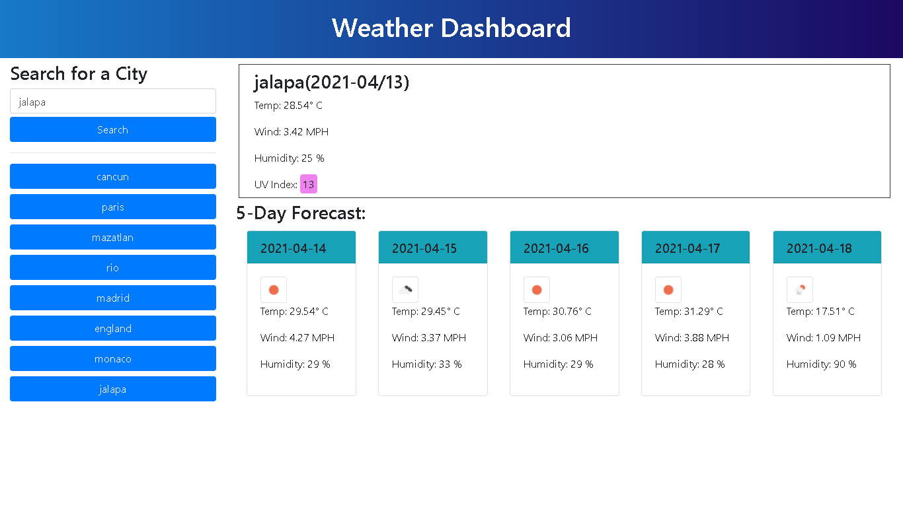

# weather-dashboard
# Weather Dashboard
## Weather Dashboard Requirements
* Application for travelers users wanting to see the weather outlook for multiple cities so they can plan a trip accordingly.
* This application will use localStorage to store any persistent data.
* This weather dashboard have form inputs for searching a city presenting the current and future conditions for that city and that city is added to the search history.
* After founding the current weather conditions for that city, it is presented with the city name, the date, an icon representation of weather conditions, the temperature, the humidity, the wind speed, and the UV index.
* The UV index is presented with a color that indicates whether the conditions are favorable, moderate, or severe.
* It is presented the future weather conditions for that city with a 5-day forecast that displays the date, an icon representation of weather conditions, the temperature, the wind speed, and the humidity.
* Clicking on a city in the search history it is presented with current and future conditions for that city.
* It is also shown an alert message when the city is not found.

# Project Image

# Website Link
[Weather Dashboard](https://jorgeatcabo.github.io/weather-dashboard/)